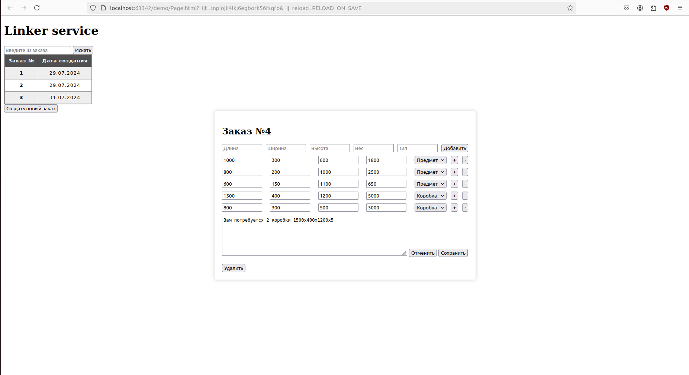

# order-linker

Сервис компоновки.

Компоновщик принимает от клиента список предметов различного типа (предмет, коробка) и подбирает для предметов тип
коробки с наилучшим заполнением и необходимое количество коробок для всех предметов.

## Визуальная схема фронтенда

## Документация

1. Маркетинг и аналитика
    1. [Целевая аудитория](../../../Desktop/repo/marketplace/docs/01-biz/01-target-audience.md)  
    2. [Пользовательские истории](../../../Desktop/repo/marketplace/docs/01-biz/02-bizreq.md)
2. Аналитика:
    1. [Функциональные требования](../../../Desktop/repo/marketplace/docs/02-analysis/01-functional-requiremens.md)
    2. [Нефункциональные требования](../../../Desktop/repo/marketplace/docs/02-analysis/02-nonfunctional-requirements.md)
3. DevOps
    1. [Файлы сборки](./deploy)
4. Архитектура
    1. [Компонентная схема](../../../Desktop/repo/marketplace/docs/03-architecture/01-arch.md)
    2. [Описание API](../../../Desktop/repo/marketplace/docs/03-architecture/02-api.md)

# Структура проекта

## Мониторинг и логирование
1. [deploy](deploy) - Инструменты мониторинга и деплоя  

### Транспортные модели, API
Описание API в форме OpenAPI-спецификаций

## Фреймворки и транспорты
Приложение на Spring Framework  
Микросервис на Kafka  

## Модули бизнес-логики
Стабы для ответов сервиса  
Модуль бизнес-логики приложения: обслуживание стабов, валидация, работа с БД  
